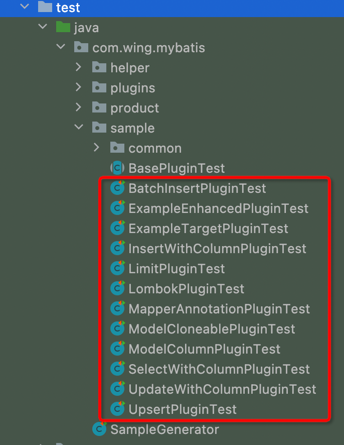

# MyBatis Generator插件扩展包

本项目通过MyBatis Generator官方提供插件拓展能力，自定义了部分插件，增强了MyBatis Generator的能力，能够自动生成一些常用的代码，减少代码量。

本项目在itfsw大佬项目（ https://github.com/itfsw/mybatis-generator-plugin ）的基础上，进行了一些个性化的调整和补充。

mgb插件开发比较简单，官方提供了完善的拓展机制，只要继承PluginAdapter类，按照需求实现对应的方法即可。PluginAdapter类中不同方法的含义和执行时机见：http://mybatis.org/generator/reference/pluggingIn.html

在test包的sample目录下，提供了较为完整的使用的代码样例，使用前可参考。


本项目的单测用例需要借助实际的Mysql数据库，测试前修改src/test/resources/db.properties中的数据库配置即可。

####注意：
由于本人平时工作只使用mysql数据库，所以本项目只针对mysql做了测试和验证，其他类型的数据库配置的插件不会生效。
另外，本项目只在 ModelType=flat，targetRuntime=MyBatis3 的模式下生效。

#### 1.修改Example包路径——ExampleTargetPlugin
原生的mgb中，domain和example类在同一个包下，有时候希望能放在不同的包下，看起来会更清晰；而原生的exampleTargetPackage配置不能生效，故通过插件来指定example类的包路径。
```xml
<plugin type="com.wing.mybatis.plugins.ExampleTargetPlugin">
  <property name="targetPackage" value="com.wing.mybatis.product.example"/>
</plugin>
```

说明：通过 targetPackage 属性指定目标包路径，所有的Example类都会放入到改目录下。


#### 2.自动添加Mapper注解——MapperAnnotationPlugin

```xml
<plugin type="com.wing.mybatis.plugins.MapperAnnotationPlugin"/>
```

说明：开启后，可以自动在Mapper接口上添加@Mapper注解。

```java
@Mapper
public interface UserMapper {
}
```


#### 3.自动添加Lombok注解——LombokPlugin
Lombok注解在平时的项目中非常场景，可以大大减少低效的编码，增加代码的可读性，该插件可以自动在生成的domain类上添加lombok注解。
```xml
<plugin type="com.wing.mybatis.plugins.LombokPlugin">
	<property name="@AllArgsConstructor" value="true"/>
	<property name="@NoArgsConstructor" value="true"/>
	<property name="@Builder" value="true"/>
</plugin>
```

说明：LombokPlugin插件默认会添加@Data注解，并去除getter、setter方法。另外，通过属性可支持AllArgsConstructor、NoArgsConstructor和Builder注解，属性名中通过括号携带的参数会带入到实际的注解中，且属性值为true时才会生效。

```java
@Builder
@NoArgsConstructor
@AllArgsConstructor
@Data
public class User {
}
```


#### 4.为数据模型类添加复制方法——ModelCloneablePlugin

```xml
<plugin type="com.wing.mybatis.plugins.ModelCloneablePlugin">
  <property name="enableDeepClone" value="true"/>
</plugin>
```

说明：通过enableDeepClone属性可支持深拷贝接口，深拷贝使用IO流实现。

```java
public class User implements Cloneable, Serializable {
  
    @Override
    public User clone() throws CloneNotSupportedException {
        return (User)super.clone();
    }

    public User deepClone() throws IOException, ClassNotFoundException {
        ByteArrayOutputStream byteArrayOutputStream = new ByteArrayOutputStream();
        ObjectOutputStream objectOutputStream = new ObjectOutputStream(byteArrayOutputStream);
        objectOutputStream.writeObject(this);
        ByteArrayInputStream byteArrayInputStream = new ByteArrayInputStream(byteArrayOutputStream.toByteArray());
        ObjectInputStream objectInputStream = new ObjectInputStream(byteArrayInputStream);
        User target = (User)objectInputStream.readObject();
        objectOutputStream.close();
        objectInputStream.close();
        return target;
    }
```


#### 5.Example增加——ExampleEnhancedPlugin
本插件旨在将example对象的所有调用都使用链式调用实现，增强代码的可读性。
```xml
<plugin type="com.wing.mybatis.plugins.ExampleEnhancedPlugin"/>
```

说明：

1.新增静态方法newAndCreateCriteria()方法，Criteria新增example()方法，方便使用链式调用。

2.新增orderBy()方法，增强排序字段配置，支持链式调用；Example中新增SortType枚举。

3.增强distinct的链式调用。

4.Example和Criteria增加when()方法，方便根据不同情况增加查询条件。

```java
//newAndCreateCriteria() 、 example() 、 orderBy()
UserExample example = UserExample.newAndCreateCriteria()
            .example()
            .orderBy("id", SortType.ASC);

//SortType枚举
public enum SortType {
  ASC("asc"),
  DESC("desc");
}
//distinct
UserExample example = UserExample.newAndCreateCriteria()
            .example()
            .distinct(true);
//Criteria中的when方法
UserExample example = UserExample.newAndCreateCriteria()
            .when(true,
                criteria -> criteria.andIdEqualTo(1L),
                criteria -> criteria.andIdEqualTo(2L))
            .example();
//Example中的when方法
UserExample userExample = UserExample.newAndCreateCriteria()
            .andLocationEqualTo("江苏省南京市")
            .example()
            .when(true,
                example -> example.orderBy("id", SortType.ASC),
                example -> example.orderBy("id", SortType.DESC));
```


#### 6.分页插件——LimitPlugin

```xml
<plugin type="com.wing.mybatis.plugins.LimitPlugin"/>
```

说明：增强分页方法的调用，支持链式调用

```java
UserExample example = new UserExample();
//limit()
example.limit(2);
//limit()分页
example.limit(2, 2);
//page()分页
example.page(3, 2);
```


#### 7.列枚举插件——ModelColumnPlugin
开发时常常会需要知道数据库中列的名字，在某些场景下并不能直接从domain类中直接看出，而且列的名字可能会多次使用，所以提供数据库列的枚举，方便直接获取数据表的列。另外，该插件也是后续几个增加插件的基础。
```xml
<plugin type="com.wing.mybatis.plugins.ModelColumnPlugin"/>
```

说明：在Example类中添加数据表中每列的枚举，包含列名、java字段名、字段类型等，方便编码时查看。枚举中包含excludes()方法，可快速反选，方便配合后续插件使用。

```java
 public enum Column {
        ID("id", "id", "BIGINT", false),
        NAME("name", "name", "VARCHAR", true),
        AGE("age", "age", "INTEGER", false),
        LOCATION("address", "location", "VARCHAR", false),
        STATUS("status", "status", "INTEGER", true),
        CREATE_TIME("create_time", "createTime", "TIMESTAMP", false),
        UPDATE_TIME("update_time", "updateTime", "TIMESTAMP", false),
        FEATURE("feature", "feature", "LONGVARBINARY", false);

        private final String column;

        private final String javaProperty;

        private final String jdbcType;

        private final boolean isDelimited;

        public static Column ofColumn(String column) {
            Optional<Column> columnOptional = Arrays.stream(Column.values()).filter(unit -> unit.column.equals(column)).findFirst();
            return columnOptional.orElse(null);
        }

        public static Column[] excludes(Column ... excludeColumns) {
            ArrayList<Column> columns = new ArrayList<>(Arrays.asList(values()));
            if (excludeColumns != null && excludeColumns.length > 0) {
                columns.removeAll(new ArrayList<>(Arrays.asList(excludeColumns)));
            }
            return columns.toArray(new Column[]{});
        }
    }
```


#### 8.使用列枚举增强查询——SelectWithColumnPlugin
查询时，我们可能只需要查询部分列即可，不必将所有列都查询出来；另外，当只查询少数几个列时，可以通过索引优化查询。因此本插件可指定查询的列，提升查询的效能，同时也方便代码阅读。
```xml
 <plugin type="com.wing.mybatis.plugins.SelectWithColumnPlugin"/>
```

说明：在mapper中添加指定查询列的select方法，需要与ModelColumnPlugin插件配合使用。

```java
List<User> selectByExampleWithColumn(@Param("example") UserExample example, @Param("columns") UserExample.Column ... columns);
User selectByPrimaryKeyWithColumn(@Param("id") Long id, @Param("columns") UserExample.Column ... columns);
```

```java
//指定只查询name和status列，其他列返回null
User user = userMapper.selectByPrimaryKeyWithColumn(2L, Column.NAME, Column.STATUS);

UserExample example = UserExample.newAndCreateCriteria()
            .andIdGreaterThanOrEqualTo(2L)
            .example();
List<User> users = userMapper.selectByExampleWithColumn(example, Column.NAME, Column.STATUS);
```


#### 9.使用列枚举增强插入——InsertWithColumnPlugin
在一些开发场景下，插入记录时使用的domain对象可能会在多处使用，但插入时只希望插入部分列。使用本插件提供但方法插入时，可指定只插入部分列，其他列会直接无视domain中的值，置为null或使用默认值。
将domain中的部分列置为null，并使用insertSelective()方法也可实现该效果，但需要额外的代码，且不易阅读。
```xml
<plugin type="com.wing.mybatis.plugins.InsertWithColumnPlugin"/>
```

说明：在mapper中添加指定查询列的insert方法，需要与ModelColumnPlugin插件配合使用。

```java
int insertWithColumn(@Param("record") User record, @Param("columns") UserExample.Column ... columns);
```

```java
//插入时，指定只插入部分列，其他列为空或使用默认值
int num = userMapper.insertWithColumn(user, Column.ID, Column.NAME, Column.AGE, Column.LOCATION, Column.STATUS);
```


#### 10.使用列枚举增强更新——UpdateWithColumnPlugin
在一些开发场景下，我们只希望更新部分domain对象中的部分列，其他列保持不变。本插件就可以在更新时指定需要更新列，不影响其他列的变化，且更易阅读。
```xml
<plugin type="com.wing.mybatis.plugins.UpdateWithColumnPlugin"/>
```
说明：在mapper中添加指定查询列的update方法，需要与ModelColumnPlugin插件配合使用。

```java
int updateByExampleWithColumn(@Param("record") User record, @Param("example") UserExample example, @Param("columns") UserExample.Column ... columns);

int updateByPrimaryKeyWithColumn(@Param("record") User record, @Param("columns") UserExample.Column ... columns);
```

```java
//只更新name、loaction两列
UserExample example = UserExample.newAndCreateCriteria().andIdGreaterThanOrEqualTo(9L).example();
int num = userMapper.updateByExampleWithColumn(user, example, Column.NAME, Column.LOCATION);
        
int num = userMapper.updateByPrimaryKeyWithColumn(user, Column.NAME, Column.LOCATION);
```

#### 11.批量插入——BatchInsertPlugin
本插件提供批量插入的方法，配合ModelColumnPlugin插件可指定插入时生效的列。
注：使用自增主键插入时，回写到domain对象的中的id不正确，需重新查询一次以获得准确的id。
```xml
<plugin type="com.wing.mybatis.plugins.BatchInsertPlugin"/>
```

说明：在mapper中添加批量插入batchInsert()方法。如果配置了ModelColumnPlugin插件，则还会自动生成batchInsertWithColumn()方法，可指定插入时的列。

```java
int batchInsert(@Param("list") List<User> list);

int batchInsertWithColumn(@Param("list") List<User> list, @Param("columns") UserExample.Column ... columns);
```

```java
List<User> users = new ArrayList<User>() {{
            add(new User(null, "user1", 200, "江苏省扬州市", Status.AVAILABLE, date, date, "user1blob".getBytes(StandardCharsets.UTF_8)));
            add(new User(null, "user2", 200, "江苏省南通市", Status.DISABLE, date, date, "user2blob".getBytes(StandardCharsets.UTF_8)));
        }};


int num = userMapper.batchInsert(users);

int num = userMapper.batchInsertWithColumn(users, Column.ID, Column.NAME, Column.AGE, Column.STATUS);
```


#### 12.存在即更新——UpsertPlugin
通过“insert ... on duplicate key update”实现存在即更新操作。
```xml
 <plugin type="com.wing.mybatis.plugins.UpsertPlugin"/>
```

说明：使用方式类型insert。

```java
int upsert(User record);
//只对非空的字段进行处理
int upsertSelective(User record);

int upsertWithBLOBs(User record);
```

```java
User user = new User(100L, "X", 100, "江苏省扬州市", Status.AVAILABLE, date, date, "blob".getBytes(StandardCharsets.UTF_8));
int num = userMapper.upsert(user);
```

